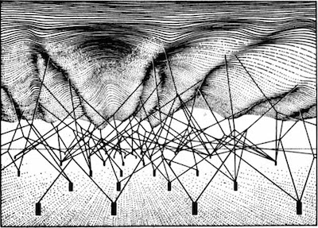
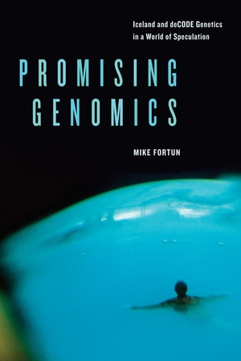
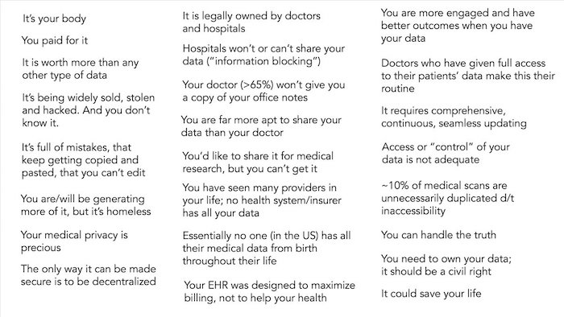
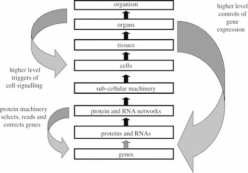
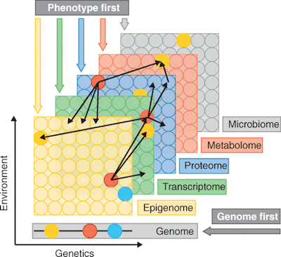
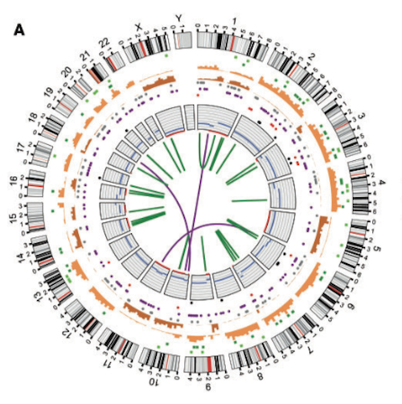
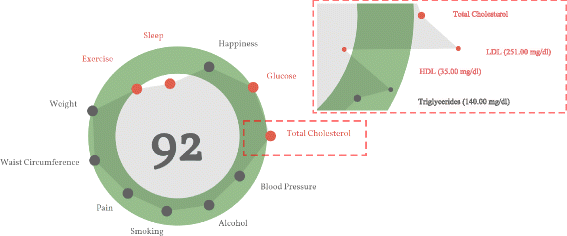

# Peergen

<blockquote>
 <em>Invert, always invert ('man muss immer umkehren').</em> 
- Carl Jacobi, 19th. c. mathematician
</blockquote>

Peergen is a system of personal datastores using [Solid](https://solidproject.org/) that ***makes the individual the primary researcher over their own healthdata***.

In biomedical terms, Peergen is a system for ***N-of-1 personal -omics at scale, in which feedback loops between data, interpretation, and patient are not avoided, but embraced***.

  

